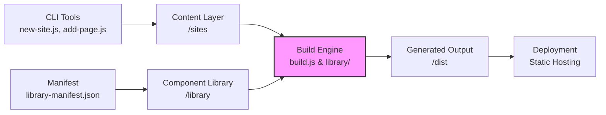

# Portfolio Site Project - ICT Architecture Overview

**For  L&D Team**  
**Project:** [Inspreadables/portfolio-site](https://github.com/Inspreadables/portfolio-site)  
**Last Updated:** August 1, 2026

## 1. Executive Summary

This project is a **library-based, multi-site static site generator** designed to create branded portfolio websites from a centralized component library. The system enables the rapid deployment of multiple, consistently branded sites (e.g., for "De Baak" house style) with minimal manual intervention.

The architecture follows a **build-time generation pattern**, separating content (in the `sites/` directory) from presentation (in the `library/` directory), making it scalable and maintainable for a team of HBO ICT students.

## 2. System Architecture Overview

The architecture is a **modular build pipeline** comprised of three core layers:

### Key Architectural Components

| Component | Path | Responsibility |
| :--- | :--- | :--- |
| **Site Content** | `/sites/[site-name]/` | Holds Markdown content, metadata, and page structure for each independent site. |
| **Component Library** | `/library/` | Contains reusable HTML templates, CSS, and JavaScript assets that define the visual identity (e.g., "De Baak" house style). |
| **Build Engine** | `build.js` | The core processor. It reads the library manifest, compiles content from all sites, and generates static HTML pages in `/dist`. |
| **CLI Utilities** | `new-site.js`, `add-page.js` | Command-line tools to scaffold new sites and pages, enforcing consistent structure. |
| **Deployment Artifact** | `/dist/` | The fully generated, static output ready for deployment to any web server or CDN. |

## 3. Data Flow & Build Process

The build process follows a **clear, deterministic pipeline**:

1.  **Initialization:** The `build.js` script loads the `library-manifest.json` to understand available components and global styles.
2.  **Site Discovery:** It scans the `/sites` directory to find all site folders.
3.  **Content Compilation:** For each site, it reads the `site.json` configuration and all `.md` page files.
4.  **Template Application:** It applies the appropriate layout from the `/library` to each page, injecting the Markdown content (converted to HTML).
5.  **Asset Processing:** Global CSS and JavaScript from the library are copied and bundled.
6.  **Output Generation:** All processed files are written to a structured `/dist/[site-name]/` directory.

This results in **fully static, pre-rendered HTML files**, offering excellent performance and security.

## 4. Infrastructure & Technology Stack

This project is designed for simplicity and accessibility, with minimal infrastructure requirements.

*   **Runtime Environment:** **Node.js**. The build scripts are JavaScript, requiring Node.js to execute.
*   **Version Control:** **Git**. All source code and content are managed in this repository.
*   **CI/CD (Optional):** A **GitHub Actions** workflow (`.github/workflows/`) is configured. This can automatically run the `build.js` script on every push to the main branch.
*   **Hosting (Target):** Any **static web hosting** service (e.g., Netlify, Vercel, Amazon S3, or a simple web server) that can serve the files from the `/dist` directory.
*   **Development Dependencies:** Node.js modules for file system operations, Markdown parsing, and templating.

## 5. Operational & Maintenance Guidelines

For the HBO ICT team, maintaining this system involves clear responsibilities:

### Common Tasks

*   **Creating a New Site:** Run `node new-site.js [site-name]`. This will scaffold a new site folder with the correct structure.
*   **Adding a Page:** Run `node add-page.js [site-name] [page-title]`. This creates a new Markdown file in the correct format.
*   **Updating the Visual Identity:** Modify the files in the `/library` directory. **Important:** Changes here will affect *all* sites that use that component.
*   **Building the Sites:** Run `node build.js`. Ensure you have Node.js installed. The output will be in the `/dist` folder.

### Team Responsibilities (Suggested)

| Role | Responsibility |
| :--- | :--- |
| **Content Manager** | Uses CLI tools to create and edit site content (Markdown files). Does not touch code. |
| **Library Developer** | Maintains `/library` (HTML/CSS/JS) to enforce consistent branding. Runs build to test visual changes. |
| **Build Master** | Manages `build.js`, GitHub Actions, and the deployment of the `/dist` folder. Troubleshoots build errors. |

### Troubleshooting Quick Guide

*   **Build Fails:** Check the console error message. Ensure `library-manifest.json` is valid JSON and all referenced files exist.
*   **Styling Missing:** Verify the library paths in `build.js` are correct and the library's CSS is properly imported.
*   **New Site Not Appearing:** Run `node list-pages.js` to see if the site is recognized. Check if the site folder has a valid `site.json`.

## 6. Security & Performance Considerations

*   **Security:** Since the system generates **static HTML**, the attack surface is minimal. No server-side code is executed at runtime. Ensure the `/dist` folder is served securely (HTTPS).
*   **Performance:** Build-time generation provides the fastest possible page load times. No server-side rendering or database queries occur on request.
*   **Maintainability:** The clear separation of content, presentation, and logic ensures that changes to one layer do not break others, making the system robust and easy to understand.

## 7. Getting Started for the Team

1.  **Clone the Repository:** `git clone https://github.com/Inspreadables/portfolio-site.git`
2.  **Install Node.js:** Ensure Node.js (LTS version) is installed on your system.
3.  **Install Dependencies:** Run `npm install` (if a `package.json` is present, or manually install required packages like `marked`, `fs-extra`).
4.  **Build the Project:** Run `node build.js`.
5.  **Preview:** Open the generated `/dist/index.html` in your browser.

This documentation serves as a living reference. Update it as the system evolves to ensure the entire HBO ICT team remains aligned and informed.
